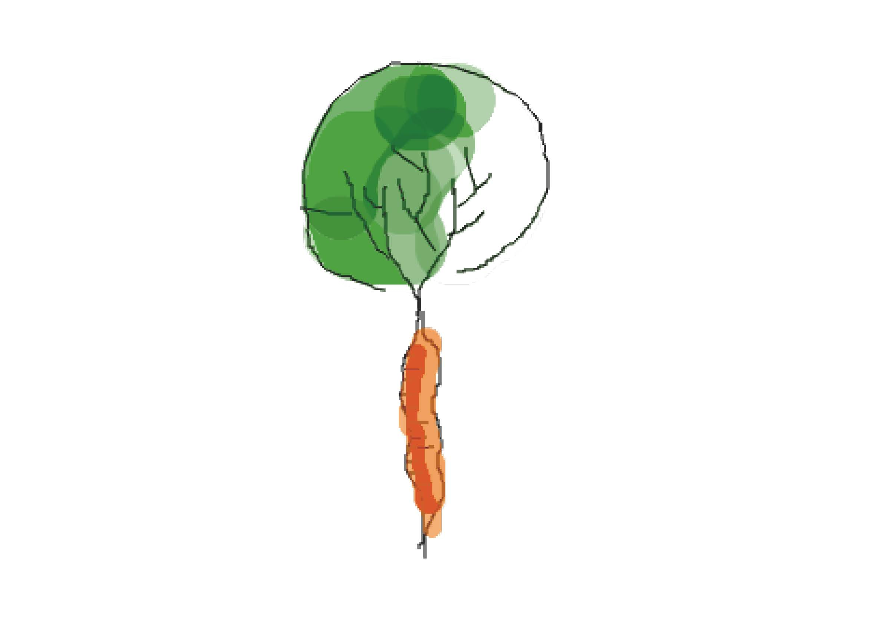

Personal Page for a University Project to learn coding

<picture>
 <source media="(prefers-color-scheme: dark)" srcset="ruebenbaum.jpg">
 <source media="(prefers-color-scheme: light)" srcset="karottenbaum.jpg">
 
</picture>
